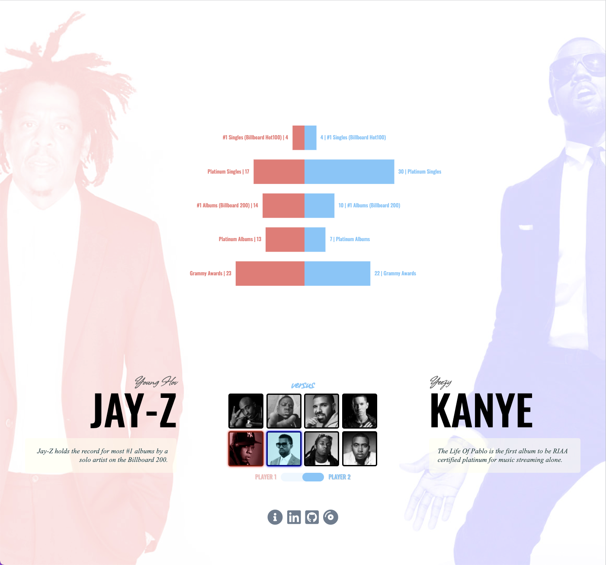
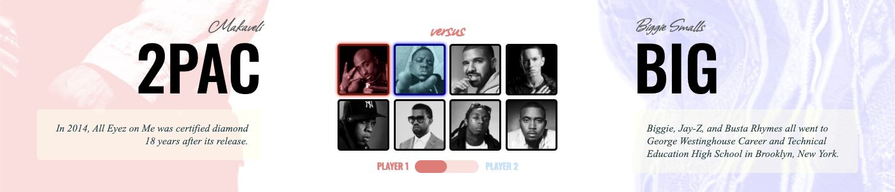
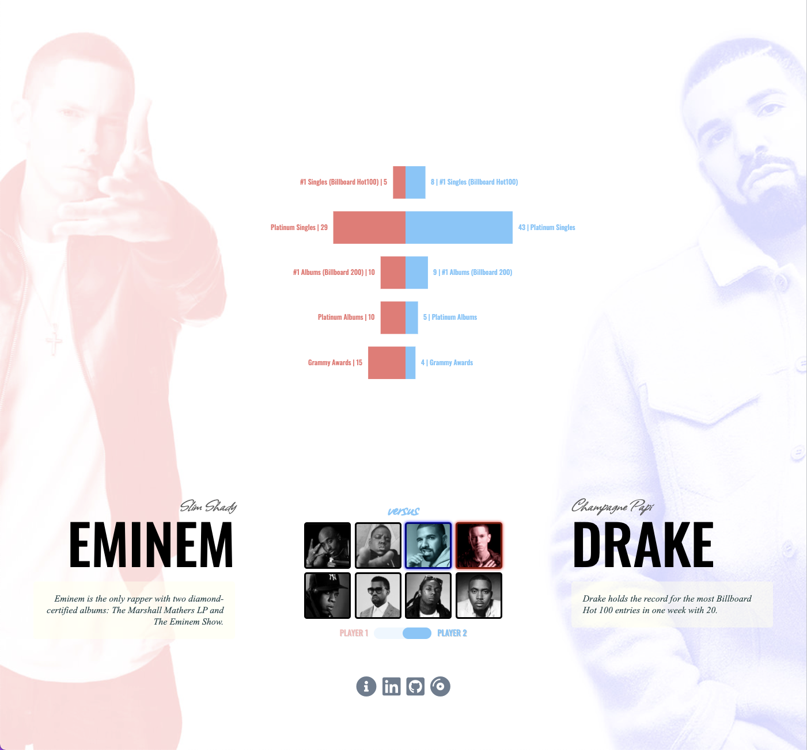

[View Versus](https://jayzizzle.github.io/versus/)

# VERSUS

## About

Versus aims to compare two musical artists within the visual format of a character select screen. Users will be able to choose from a pool of artists and see their head-to-head stats in a dynamic and interactive way.



## Functionality & MVPs

In Versus, users will be able to:
* select two music artists to compare
* observe interactive graphs
* enjoy visual data and images that dynamically change via mouse hover



## Technologies Used
* Vanilla DOM Javascript
* ChartJS
* HTML5
* CSS3

### Notable Code Snippets

```javascript
handleToggle(e) {
    e.stopPropagation();
    let ele = e.target;
    let versus = document.getElementById('versus-select');
    if (ele.checked) {
        this.playerSelect.currentSide = 'right';
        this.playerLeftLabel.classList.add('fade');
        this.playerRightLabel.classList.remove('fade');
        versus.classList.add('lightskyblue');
        versus.classList.remove('lightcoral');
    } else {
        this.playerSelect.currentSide = 'left';
        this.playerRightLabel.classList.add('fade');
        this.playerLeftLabel.classList.remove('fade');
        versus.classList.add('lightcoral');
        versus.classList.remove('lightskyblue');
    }
}
```

* Using only Vanilla DOM Javascript, I created a toggle switch to swap between sides. It also creates a color change that fades to the color of the accompanying side.

### Future Additions

* Add album sales information and visuals.
* Replace ChartJS with D3.
